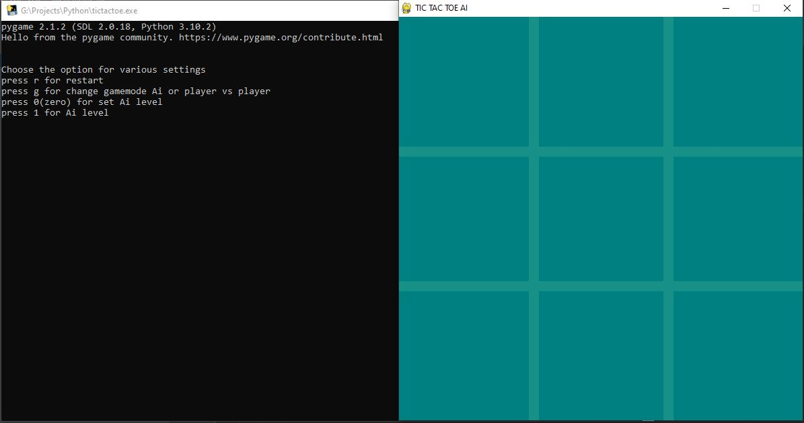
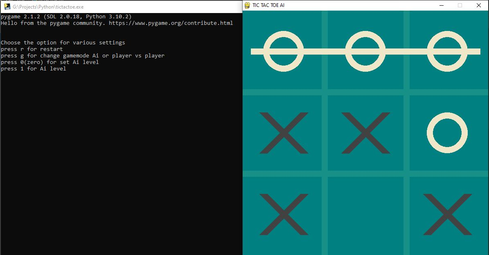

# Tic Tac Toe AI

It is a game which is buit with pygame. Here two game mode is available, one is AI and another one is player vs player. You can also set the AI level. For AI, I use minimax algorithm which is basically a backtracking algorithm. In this algorithm two player plays the game one is called MAX and other is called MIN. Both Players of the game are opponent of each other, where MAX will select the maximized value and MIN will select the minimized value.

## Built With 
This project is built with different types of libraries. Some of them are:

- pygame
- sys
- numpy
- random

## Screenshots

  
  
  

