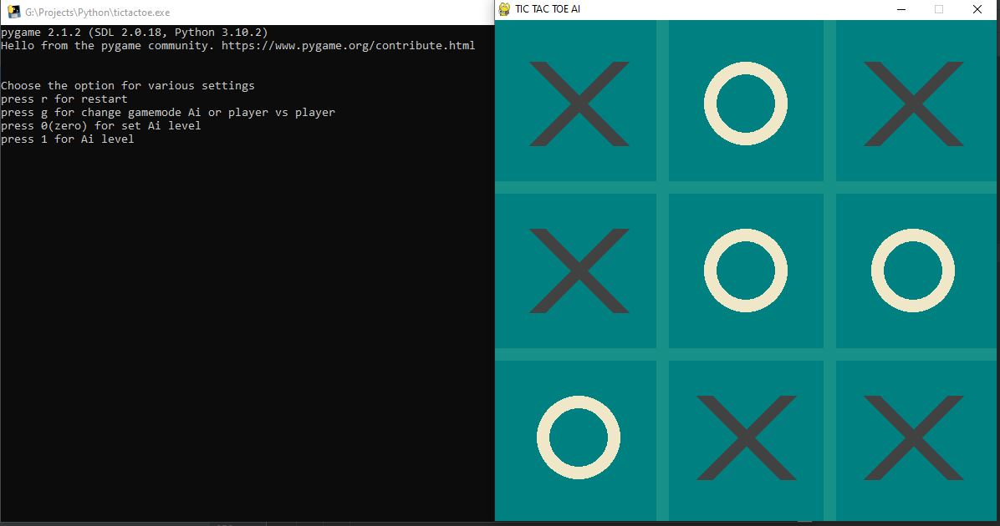

# Tic_Tac_Toe_Ai

## Introduction

Tic_Tac_Toe_Ai is a Python-based implementation of the classic Tic Tac Toe game, enhanced with Artificial Intelligence. This project allows users to play against an AI opponent that utilizes algorithms to make intelligent moves. It is designed for both learning purposes and entertainment, providing a practical example of game logic and basic AI techniques.

## Features

- Play Tic Tac Toe against an AI with adjustable difficulty.
- Simple command-line interface for easy interaction.
- Well-organized code structure suitable for educational purposes.
- AI uses strategic algorithms to challenge players.
- Clear separation of game logic, AI, and user interface components.
- Easy to extend or integrate with graphical interfaces.

## Requirements

To run this project, you need to have the following:

- Python 3.6 or higher
- No external libraries required for the base version
- Optional: `pytest` or another framework for running test scripts

## Installation

1. Clone the repository:

    ```bash
    git clone https://github.com/fuadshezan/Tic_Tac_Toe_Ai.git
    ```

2. Navigate to the project directory:

    ```bash
    cd Tic_Tac_Toe_Ai
    ```

3. (Optional) Set up a virtual environment:

    ```bash
    python3 -m venv venv
    source venv/bin/activate
    ```

4. Install dependencies (if applicable):

    ```bash
    pip install -r requirements.txt
    ```
    > Note: The basic version does not require external dependencies.

## Configuration

The Tic_Tac_Toe_Ai project is ready to use out of the box with default settings. However, you may configure or extend the game by modifying the following:

- **AI difficulty**: Adjust the AI algorithm in the code to change difficulty (e.g., random, minimax).
- **Board size**: By default, the game uses a 3x3 board. To change the board size, update the corresponding variables in the main script.
- **Player symbols**: Customize player symbols (usually 'X' and 'O') in the configuration section of the script.
- **Game modes**: Implement additional game modes such as Player vs Player or AI vs AI by extending the code.

To start the game with the default configuration, run:

```bash
python main.py
```

For further customization, explore and modify the source files as needed. Refer to inline comments in the code for detailed instructions on tweaking game logic, AI behavior, and user prompts.


## Screenshots

<p align="center">
  
  
  
</p>

